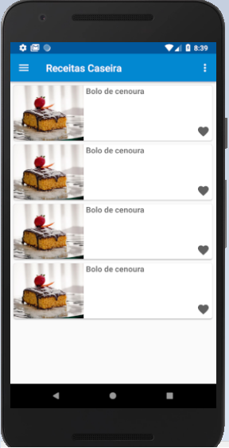

# UFG - Pós 2018/2019

## Especialização em Desenvolvimento Web e Mobile Full Stack

Trabalho final - Disciplina: Programação Mobile Avançado - Android.

---

Alunos:

* [Gilson Alves](https://github.com/gilsonalvess)
* [Vitor Santos](https://github.com/VitorSantos1996)
* [Kaichiro Fukuda](https://github.com/kaichiro)

---

- #### IMPORTANTE NOTE:
  - We recommend API-28 or higher

---

- #### Installation notes:

  - 1) Clone this project according to this command just below...
  ```sh git clone https://github.com/VitorSantos1996/ProjetoFinalAndroidUFG.git ```

  - 2) Open this project in Android Studio;

  - 3) Connect a mobile device to your computer or start a mobile virtual machine.

---


_**Credentials**_

---


---


_**list of culinary recipes**_

---


_**culinary recipes**_

---


_**culinary recipes comments (one photo can be attributed for each comment)**_

---


---


